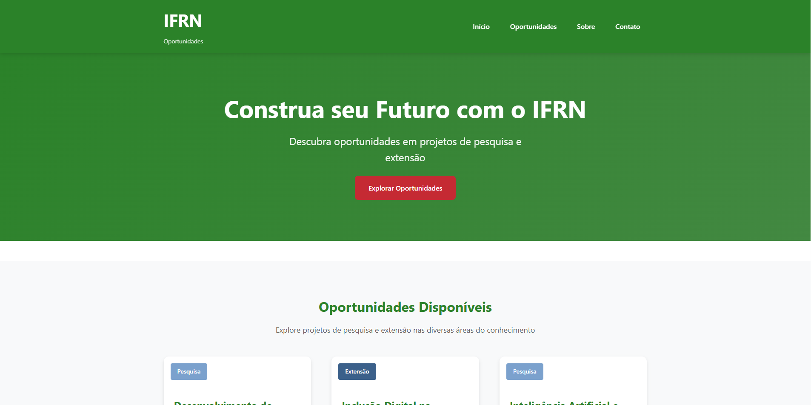
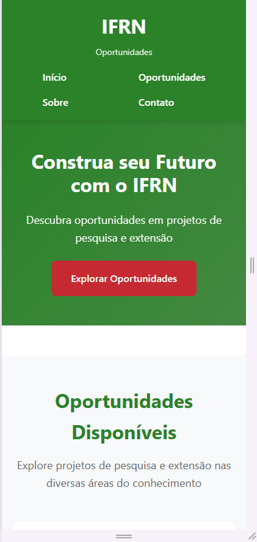
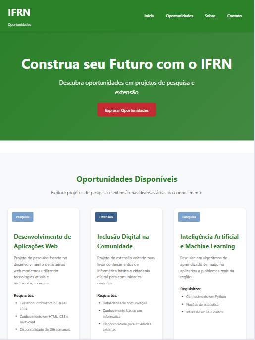
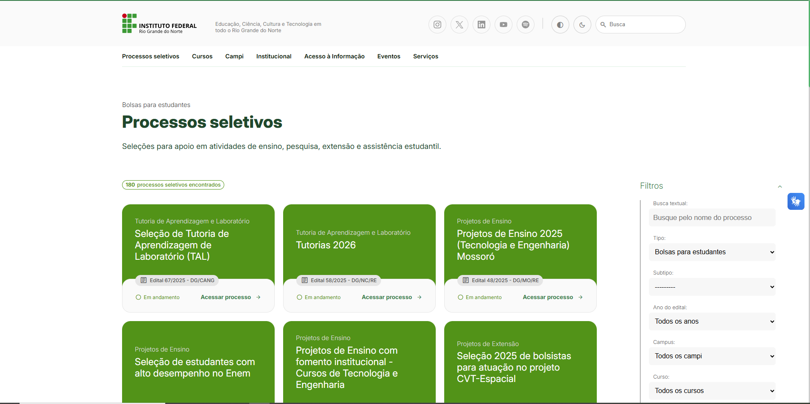

# Landing Page - Oportunidades IFRN

## Sobre o Projeto

Este projeto consiste em uma landing page responsiva que simula a apresentação de oportunidades de pesquisa, extensão e ensino do Instituto Federal de Educação, Ciência e Tecnologia do Rio Grande do Norte (IFRN).

### Características Principais

- **Mobile First**: O projeto foi desenvolvido priorizando a experiência em dispositivos móveis, garantindo usabilidade e performance em smartphones e tablets
- **Design Responsivo**: Adaptado para diferentes tipos de tela, desde dispositivos móveis até desktops de alta resolução

## Paleta de Cores

O esquema de cores utilizado foi baseado na identidade visual do IFRN, utilizando tons de verde institucional e cores complementares que garantem boa legibilidade e acessibilidade.

## Fonte de Dados

As informações sobre as oportunidades de pesquisa, extensão e ensino apresentadas na landing page foram obtidas através do **site oficial do IFRN** ([portal.ifrn.edu.br](https://portal.ifrn.edu.br)), garantindo a autenticidade e relevância do conteúdo apresentado.

## Tecnologias Utilizadas

### Linguagens e Frameworks
- HTML5
- CSS3

### Ferramentas de Desenvolvimento
- **Inteligência Artificial**: Claude (Anthropic) e Gemini (Google) para auxílio no desenvolvimento e resolução de problemas
- **Stack Overflow**: Pesquisas individuais para resolução de desafios específicos
- **GitHub**: Materiais da disciplina disponibilizados no repositório do curso
- **Outros**: Desenvolvimento individual a partir da tentativa e erro

## Como Executar

1. Clone este repositório
2. Abra o arquivo `index.html` no seu navegador
3. Ou utilize um servidor local como Live Server (VS Code) para melhor experiência

## Responsividade

O projeto foi testado e otimizado para os seguintes breakpoints:
- Mobile: 320px - 767px
- Tablet: 768px - 1023px
- Desktop: 1024px+

## Prévia do Projeto

### Versão Desktop

### Versão Mobile

### Versão Tablet

## Referências

### Oportunidades - Site IFRN
